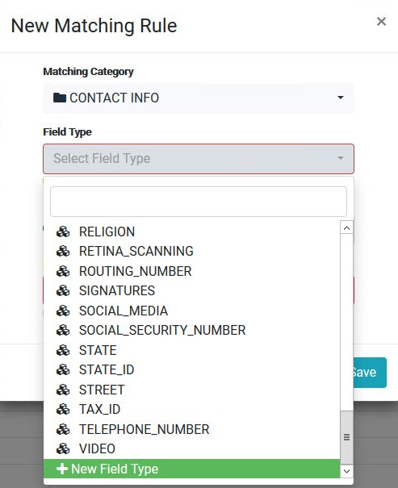
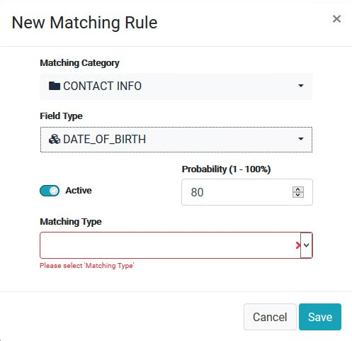
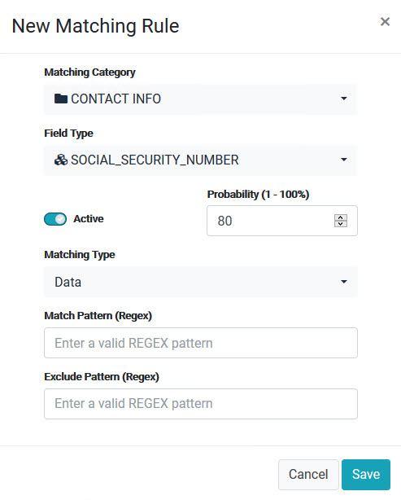
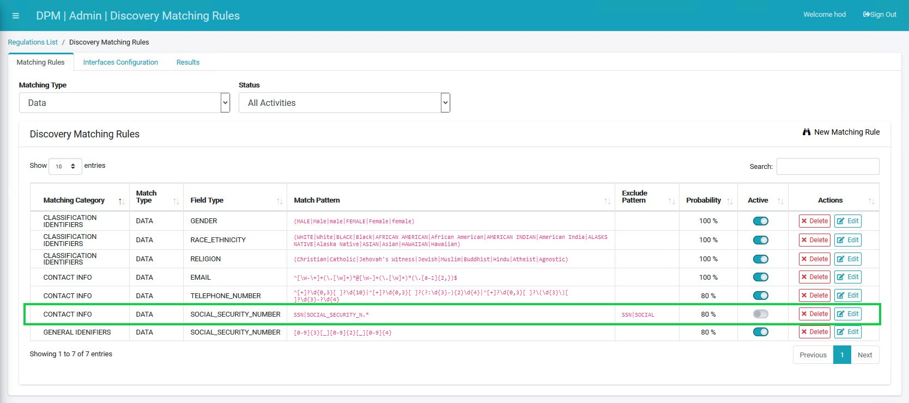

### Create a New Matching Rule - Data Type

Click the  button at the top-right of the screen in order to configure a new matching rule. 

The New Matching Rule dialog box displays. 

Select a **Matching** **Category**. Categories are used for grouping New Matching Rule topics. This field lets the user classify the new consent under an existing Category or select **New Category** to manually enter a new one.

The following example shows the New Matching Rule screen populated with sample information.

For this tutorial, select **CONTACT INFO**.

Select the **Field Type**. For this tutorial, select **SOCIAL_SECURITY_NUMBER**. 

Set the **Probability** percentage of the New Matching Rule. For example, when you validate a social security number, the 9-digit number could be an account number of the same format. Therefore, the Probability would be lower. For this tutorial, we will set the Probability to **80**%. 

Select the **Matching Type**. For this tutorial, we will select a **Data** Matching Type. 

After you select a Matching Type, additional entry fields will display. The fields that display depend upon your selection. 

Enter a **Match Pattern**.

Enter an **Exclude Pattern**.

Review your entries as needed, and then click .

The New Matching Rule displays in the Matching Rules table. If your table contains entries that span across multiple screen pages, you can distill the results by selecting the relevant Matching Type. Since we chose the “Data” Matching Type for the New Matching Rule, select **Data** from the Matching Type dropdown list.

The New Matching Rule displays in the table.

