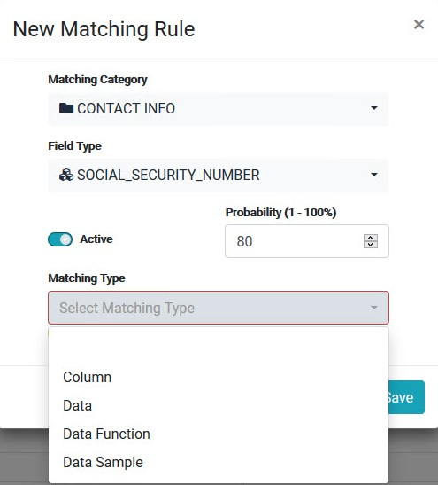
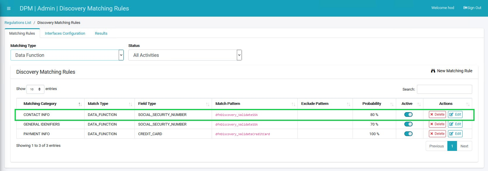

### Create a New Matching Rule - Data Function Type

The Data Function matching type allows you to indicate a function that should be executed for each field that the discovery process evaluates.
It is defined in the same way as the previous matching types. When you select the matching Type to be **function**, the list of available functions is presented in the dropdown. Additional functions can be added as part of your project implementation. 
Select the **Matching Type**. For this tutorial, we will select a **Data Function** Matching Type. 

After you select a Matching Type, additional entry fields will display. The fields that display depend upon your selection. 

Select a **Data Function** from the dropdown list. For this tutorial, select **dfnDiscovery_ValidateSSN**.

Review your entries as needed, and then click .

The New Matching Rule displays in the Matching Rules table. If your table contains entries that span across multiple screen pages, you can distill the results by selecting the relevant Matching Type. Since we chose the “Data Function” Matching Type for the New Matching Rule, select **Data Function** from the Matching Type dropdown list.

The New Matching Rule displays in the table.

